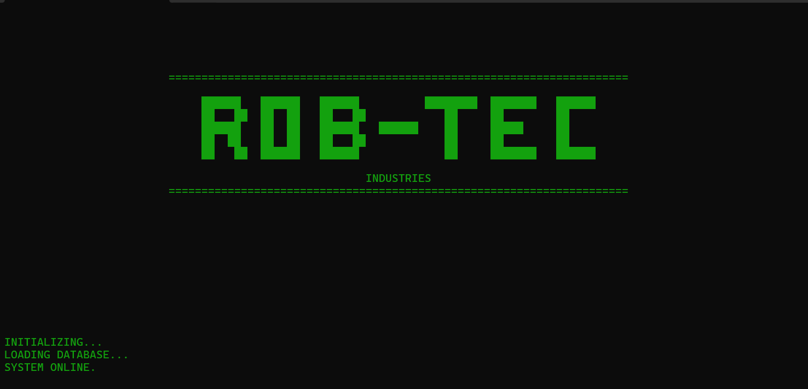
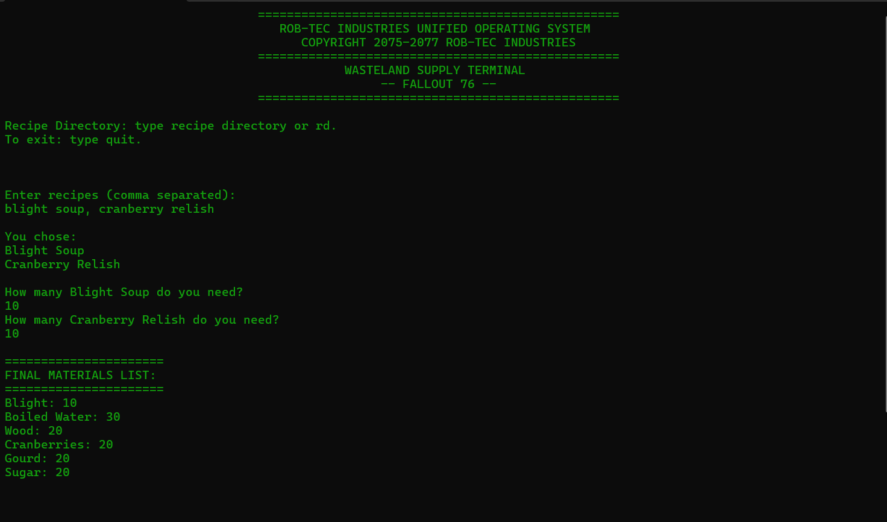
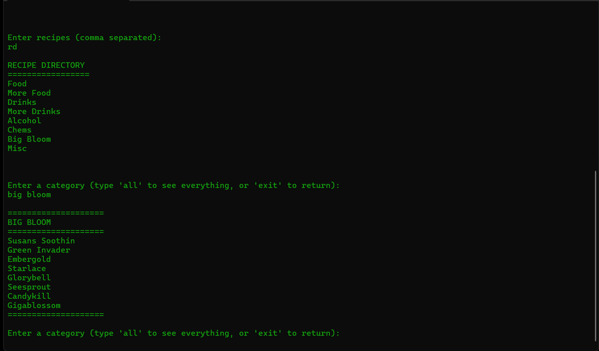
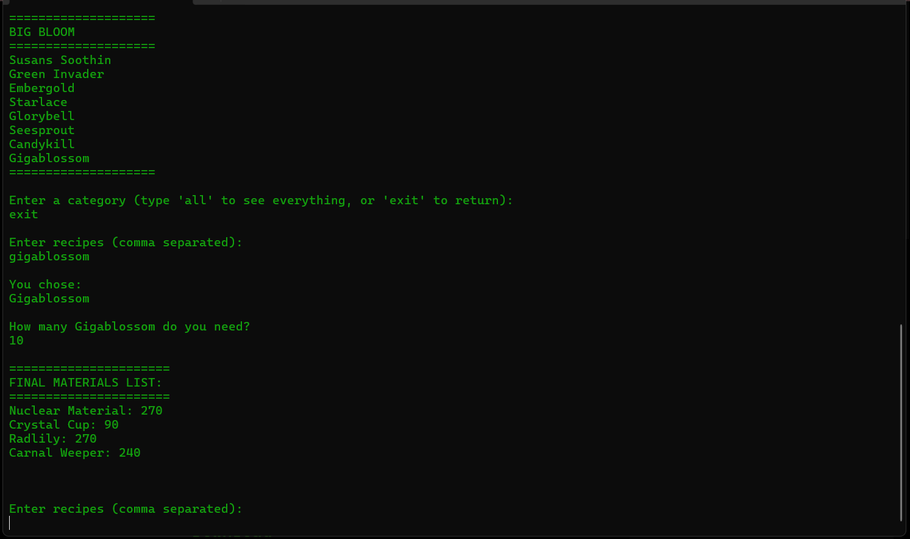

# Wasteland Supply Terminal
## Fallout 76 Resource Calculator

The Wasteland Supply Terminal is a tool that allows you to input as many recipes as you'd like, then automatically calculates every material you need for them. It also includes a recipe directory where you can see what recipes are available.

---------------
### HOW TO USE:
-To launch the program, just double click the WastelandSupplyTerminal.exe. A command terminal will appear.

-When entering recipes, separate them with commas.
    Ex. blight soup, brain bombs, cranberry relish

---------------
### WHERE TO USE:
#### Download via GitHub Releases:
https://github.com/mercyasaurus/WastelandSupplyTerminal/releases/tag/v1.0 

#### Download via Itch.io:
https://mercyasaurus.itch.io/wastelandsupplyterminal

#### You can also use a temporary web version (no download required) via Streamlit using this link:
wsterminal.streamlit.app 
(Please note that the Streamlit page is temporary as I work on an
official website.)

---------------
#### SUPPORT/FEEDBACK:
Please open an issue on the GitHub repository page:
https://github.com/mercyasaurus/WastelandSupplyTerminal/issues
OR you can contact me via:
Reddit: u/mercilius_
X (Twitter): @mercyasaurus

If you want to support future development, you can go here!
https://ko-fi.com/mercyasaurus
Donations are never required, but always appreciated! :)

---------------
### Screenshots

Programming Language: Python
Credits: 
Fallout 76 is owned by Bethesda Game Studios.
